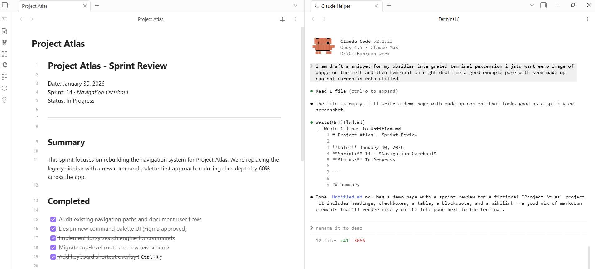

# Integrated Terminal

A lightweight integrated terminal for Obsidian, embedded directly in your workspace.



## Usage

- Use the command palette to run **Integrated Terminal: Toggle terminal** or **Open new terminal**
- Click the terminal icon in the ribbon (left sidebar)

## Recommended setup

For a VS Code-like experience, add these keybindings in **Settings > Hotkeys**:

| Command                              | Hotkey       |
| ------------------------------------ | ------------ |
| Integrated Terminal: Toggle terminal | `Ctrl + `` ` |

To free up `Ctrl+P` for the command palette (like VS Code), add this to your
`.obsidian/hotkeys.json`:

```json
{
	"command-palette:open": [
		{
			"modifiers": ["Mod", "Shift"],
			"key": "P"
		}
	],
	"switcher:open": [
		{
			"modifiers": ["Mod"],
			"key": "P"
		}
	]
}
```

## Features

- **Integrated terminal** — open a terminal panel directly inside Obsidian
- **Shell selection** — choose from platform-detected presets (PowerShell, pwsh, CMD, Git Bash, WSL, Bash, Zsh) or specify a custom shell path in settings
- **Multiple terminal tabs** — run several sessions side-by-side with rename support (right-click tab → Rename)
- **Theme sync** — terminal colors automatically adapt to your Obsidian theme, including dark/light mode changes
- **Configurable font** — adjust terminal font size and family in settings
- **`.claude` dotfolder sidebar** — browse and edit files from the `.claude` folder that Obsidian's native explorer hides, with auto-refresh on changes

## Installation

Search for **Integrated Terminal** in Obsidian's community plugins browser.
